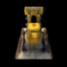

# TinyNeRF-pytorch
Pytorch implementation of optimizing a tiny Neural Radiance Field ([NeRF paper](https://arxiv.org/abs/2003.08934))

Code structure is fully based on [Original tiny NeRF code](https://colab.research.google.com/github/bmild/nerf/blob/master/tiny_nerf.ipynb#scrollTo=lLDTVWKq7-ei) using Tensorflow

To bridge between Pytorch and Tensorflow, I referenced functions implemented [here](https://colab.research.google.com/drive/1rO8xo0TemN67d4mTpakrKrLp03b9bgCX#scrollTo=UuZn7lMFDZXy)

## Dependency
Python 3 dependencies:
* Pytorch >= 1.12.0
* numpy
* matplotlib
* tqdm
* imageio (In case save result video)

Install packages via requirements:
```
pip install -r requirements.txt
```

## Run code
To optimize TinyNeRF, run `tiny_nerf.py`
```
python tiny_nerf.py
```
The optimization time depends on your computer's specifications, but takes approximately 10 minutes.

## Result
3D rendered rotating object video(`video.mp4`) will be saved after model optimized


